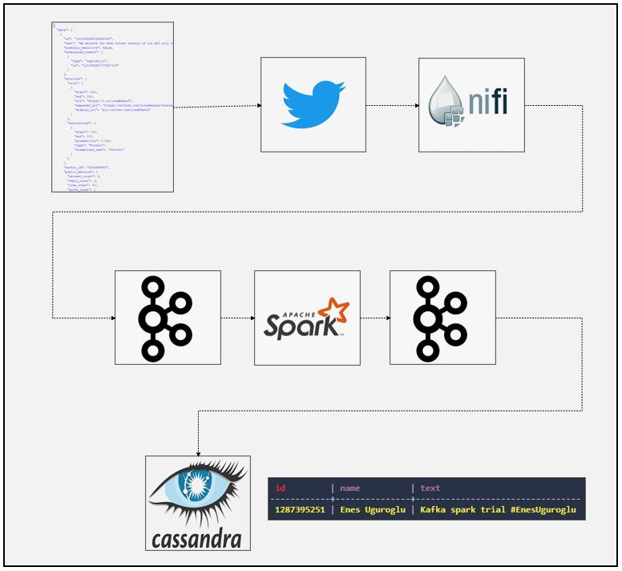
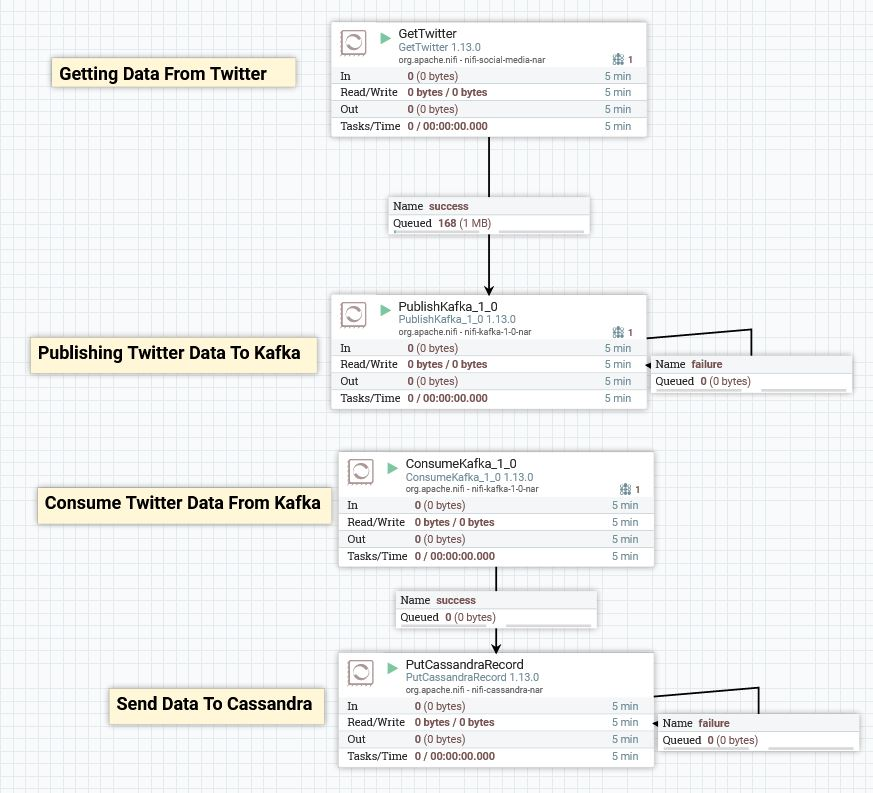
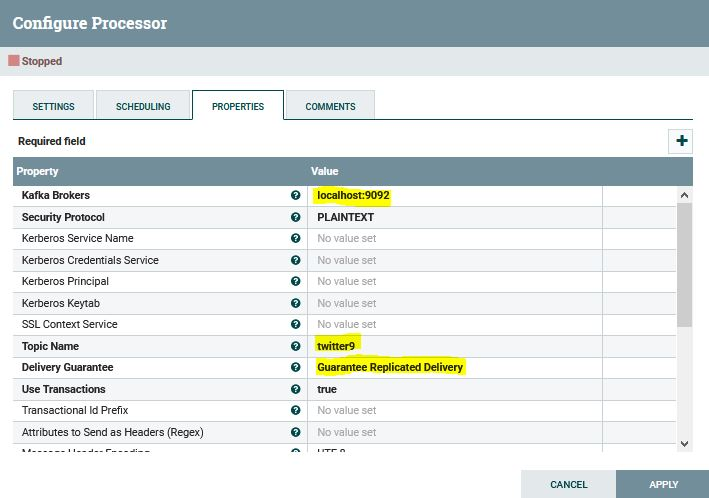
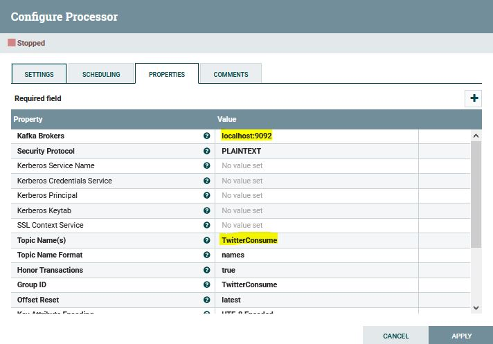
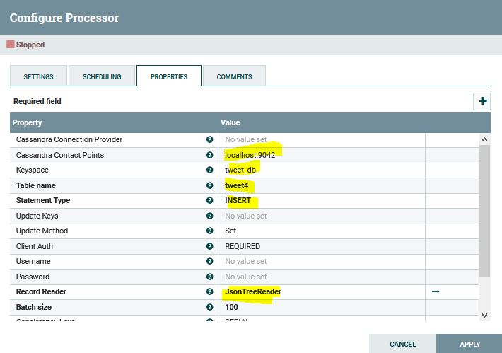

# Spark_Kafka_Stream_Twitter
### Dataflow Pipeline


### Task List

- [x] Create twitter developer account
- [x] Install nifi and insert below processors


- [x] Double click to GetTwitter processor and insert keys as well as tweet you are going to search


- [x] Double click to PublishKafka processor and insert topic name, broker port 


- [x] Double click to ConsumeKafka processor and insert topic name, broker port


- [x] Double click to PutCassandraRecord processor and insert contact point, key point, table name, Record Reader


- [x] Create spark session
```
    spark = SparkSession \
        .builder \
        .appName("PythonStreamingKafkaTweetCount") \
        .master("local[3]") \
        .config("spark.streaming.stopGracefullyOnShutdown", "true") \
        .getOrCreate()
 ```
- [x] Create schema for desired informations
```
    #Preparing schema for tweets
    schema = StructType([
    	StructField("text", StringType()),
        StructField("user", StructType([
            StructField("id",StringType()),
            StructField("name",StringType())
        ])),
    ])
 ```
- [x] Read stream from kafka topic
```
    #Read from kafka topic named "twitter"
    kafka_df = spark.readStream \
        .format("kafka") \
        .option("kafka.bootstrap.servers", "localhost:9092") \
        .option("subscribe", "twitter9") \
        .option("startingOffsets", "earliest") \
        .load()
```
- [x] Deserialize json value from string (Because we read from Kafka)
```
value_df = kafka_df.select(from_json(col("value").cast("string"),schema).alias("value"))
```
- [x] Create structure using Spark DataFrame functions
```
    explode_df = value_df.selectExpr("value.text",
                                     "value.user.id", "value.user.name")

    kafka_target_df = explode_df.selectExpr("id as key",
                                                 "to_json(struct(*)) as value")
```
- [x] Write stream to the kafka consumer
```
    nifi_query = kafka_target_df \
            .writeStream \
            .queryName("Notification Writer") \
            .format("kafka") \
            .option("kafka.bootstrap.servers", "localhost:9092") \
            .option("topic", "TwitterConsume") \
            .outputMode("append") \
            .option("checkpointLocation", "chk-point-dir") \
            .start()

    nifi_query.awaitTermination()
    console_query.awaitTermination()
 ```
- [ ] Write stream to the cassandra

### Code Description

To implement this project yourself you need to apply twitter developer account first. You can use [link](https://developer.twitter.com/en/apply-for-access) to submit an application. Then you can follow steps mentioned on the task list above.

kafka_tweet_producer.py is used to connect Twitter API with the Apache Kafka as well as filtering streams accourding to given hashtag.

twitter_structured_stream_spark_kafka_console.py  is used to create sparksession to read from Kafka topic and make necessary transformations on the data. Finally we are printing outputs to the console

### Running

1. Start zookeeper (Check kafka scripts)
```
zookeeper-server-start.bat config\zookeeper.properties (zookeeper-server-start.sh for linux)
 ```
2. Start kafka (Check kafka scripts)
```
kafka-server-start.bat config\server.properties  (kafka-server-start.sh for linux)
 ```
3. Execute below code first
```
spark-submit kafka_tweet_producer.py
```
4. Finally execute below code
```
spark-submit --packages org.apache.spark:spark-sql-kafka-0-10_2.12:3.0.1 twitter_structured_stream_spark_kafka_console.py
```
Note that we added spark kafka integration package taken from maven respository, if you already added this one into your spark conf you can skip that part.


